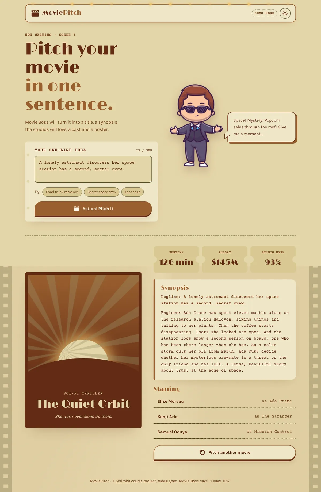

# Movie Pitch

Give Movie Boss a one-sentence idea and get a full movie pitch back: a title, a synopsis, a cast, box-office stats and a poster, all written by AI.

**[▶ Live demo](https://brutall100.github.io/scrimba-ai-movie-pitch/)** · **[Source code](https://github.com/brutall100/scrimba-ai-movie-pitch)**



## About

This started as a project from the Scrimba AI course, where you learn to call the OpenAI API from JavaScript. I rebuilt it so that:

- the **API key stays on a small Node server** and never reaches the browser,
- it runs on **GitHub Pages in demo mode** (no server needed), and
- it has its own look: a **vintage picture palace**, with marquee bulbs, rolling film strips, film grain and a projector beam.

### Two modes

| Mode | Where | What happens |
| --- | --- | --- |
| **Demo mode** | GitHub Pages, or the local server without a key | Movie Boss picks a ready-made pitch that fits your idea (space, romance, crime, animals…). The actors in demo pitches are made up. |
| **Live AI** | Local server with `OPENAI_API_KEY` | The server asks OpenAI for the pitch (JSON) and a poster image, then sends them to the page. |

The page checks `api/health` when it loads. If the server answers, the badge says **Live AI**. Otherwise it says **Demo mode**.

## Features

- ✍️ One-line idea → title, tagline, genre, synopsis, cast and poster
- 🎟️ Stats on ticket-stub cards (runtime, budget, studio hype) that count up
- 🎬 Clapperboard button that snaps on hover, lifts, presses down and ripples
- 🌗 Light and dark theme: follows your system, has a toggle, remembers your choice and never flashes on load
- 🎞️ Living background (beam, film strips, grain), animated with `transform` and `opacity` only
- 📱 Works on phones down to 390 px wide, with no sideways scrolling
- ♿ Skip link, visible focus rings, labelled form, alt text, and `prefers-reduced-motion` turns all motion off
- 🔐 Server-side key, input length check, no user text inserted as HTML

## Built with

- HTML, CSS and vanilla JavaScript (ES modules), with no build step
- Node.js 18+ (built-in `http` and `fetch`, **zero npm dependencies**)
- OpenAI API: Chat Completions (JSON mode) and Images

### Colour palette

All colours are CSS variables at the top of [`css/style.css`](css/style.css).

| Colour | HEX | Used for |
| --- | --- | --- |
| Mahogany | `#622B14` | Text and headings (light), poster frame. 7.7:1 on parchment |
| Copper | `#995F2F` | Buttons and accents. Small text uses a darker copper `#7A4520` (5.4:1) |
| Olive | `#978F66` | Decorative lines and film strips. Input borders use a darker olive `#6F6843` (3.9:1) |
| Parchment | `#E4D6A9` | Page background (light), text (dark) |
| Dark cinema | `#1E120B` | Dark-mode background, made from the mahogany |

Every text and colour pair was checked against WCAG: at least 4.5:1 for normal text and 3:1 for large text and UI.

### Fonts (Google Fonts)

- **Limelight**: art-deco cinema headings
- **Karla**: body text
- **Courier Prime**: the screenplay font for the idea box, synopsis and labels

## What I learned

- How to keep an API key secret by moving the calls to a server, and why a key in front-end code is always public.
- How to ask a model for **structured JSON** so a single request fills the whole page.
- How to give a static site a fallback mode so the same code works on GitHub Pages and with a real backend.
- How to build a theme system with CSS variables, dark mode that follows the system, and a no-flash theme toggle.
- How to animate cheaply (only `transform` and `opacity`) and respect `prefers-reduced-motion`.

## Run it locally

You need [Node.js](https://nodejs.org/) 18 or newer.

```bash
git clone https://github.com/brutall100/scrimba-ai-movie-pitch.git
cd scrimba-ai-movie-pitch

# 1. Add your own OpenAI key (the .env file is git-ignored)
cp .env.example .env
#    then open .env and paste your key after OPENAI_API_KEY=

# 2. Start the server
npm start
```

Open <http://127.0.0.1:5173>. The badge should say **Live AI**.

Without a key, the server still runs and the site uses demo mode. You can also open the site with any static server (for example `npx http-server`) to see exactly what GitHub Pages shows.

Optional settings in `.env`:

| Variable | Default | Meaning |
| --- | --- | --- |
| `OPENAI_MODEL` | `gpt-4o-mini` | Text model for the pitch |
| `OPENAI_IMAGE_MODEL` | `gpt-image-1` | Image model for the poster |
| `PORT` | `5173` | Server port |

## Project structure

```
scrimba-ai-movie-pitch/
├── index.html            # Page markup
├── css/
│   └── style.css         # Palette variables, layout, animations
├── js/
│   ├── theme-init.js     # Sets the saved theme before the first paint
│   ├── app.js            # Form, mode detection, rendering the pitch
│   ├── ui.js             # Theme toggle, ripples, scroll reveal, count-up
│   └── demo-pitches.js   # Ready-made pitches for demo mode
├── server/
│   └── server.js         # Static files + /api/health + /api/pitch (OpenAI)
├── images/
│   ├── movie-boss.webp
│   └── favicon.svg
├── docs/
│   └── screenshot.webp
├── .env.example          # Copy to .env and add your key
└── package.json
```

## Credits

- Original project idea and the Movie Boss character come from the [Scrimba](https://scrimba.com/) AI course.
- Fonts: [Limelight](https://fonts.google.com/specimen/Limelight), [Karla](https://fonts.google.com/specimen/Karla) and [Courier Prime](https://fonts.google.com/specimen/Courier+Prime) from Google Fonts.
- Pitches and posters in live mode are generated by the OpenAI API.

Code licensed under the [MIT License](LICENSE). The Movie Boss character belongs to Scrimba.
